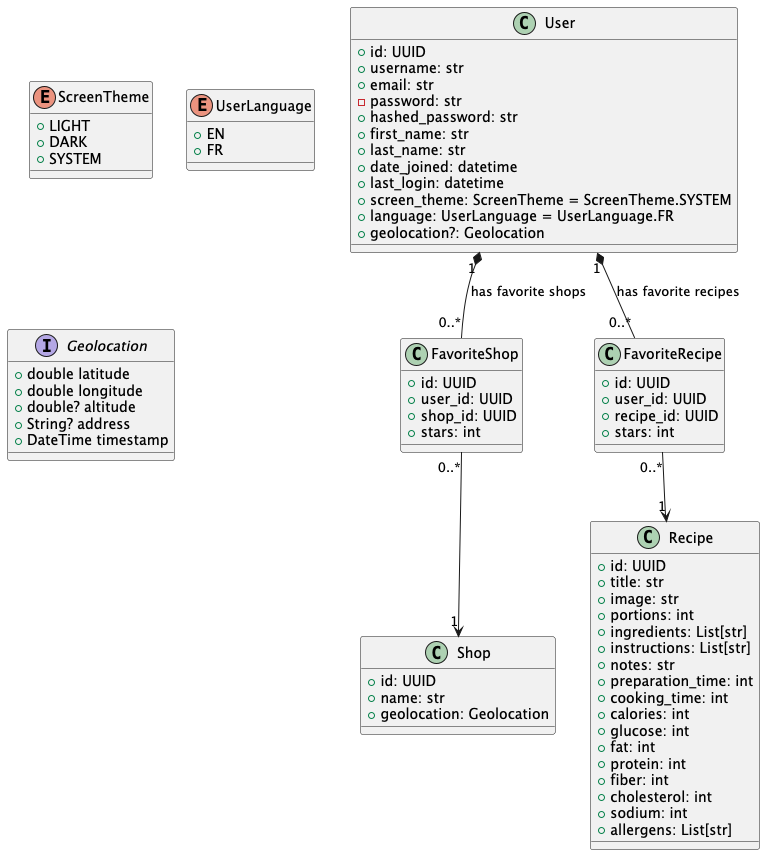

# Welcome to Food Tracker documentation

## User Stories

**User management (CRUD):**

- [ ] USER_CREATE: User can **sign up** for a new account
- [ ] USER_READ: User can **display their profile** information
- [ ] USER_UPDATE: User can **update their profile** information
- [ ] USER_DELETE: User can **delete their account**

**Authentication:**

- [ ] USER_LOGIN: User can **login** to their account
- [ ] USER_LOGOUT: User can **logout** of their account
- [ ] USER_RESET_PASSWORD: User can **reset password** if they forget it

**User preferences:**

- [ ] THEME_SELECT: User can **select a theme** for the app: light, dark, or system default
- [ ] GEOLOCATE: User can **geo-locate** their current location (GPS)
- [ ] USER_LANGUAGE: User can **select a language** for the app: English, French.

**Shops management (restaurants/grocery stores):**

- [ ] SHOP_SEARCH: User can **search for restaurants/grocery stores** by location in a map view
- [ ] SHOP_SAVE: User can **save a restaurant** to their favorites
- [ ] SHOP_REMOVE: User can **remove a restaurant** from their favorites
- [ ] SHOP_FAVORITES: User can **view a list of their favorite restaurants**
- [ ] SHOP_UPDATE: User can **update a shop** information: title, comments, photos
- [ ] SHOP_CHECK: User can **check a shop** information: opening hours, location, phone number

**Recipes management:**

- [ ] RECIPE_SEARCH: User can **search for recipes** by name or ingredients
- [ ] RECIPE_SAVE: User can **save a recipe** to their favorites
- [ ] RECIPE_REMOVE: User can **remove a recipe** from their favorites
- [ ] RECIPE_FAVORITES: User can **view a list of their favorite recipes**
- [ ] RECIPE_UPDATE: User can **update a recipe** information: title, image, portions, ingredients, instructions, notes,
  preparation time, cooking time, calories, glucose, fat, protein, fiber, cholesterol, sodium, allergens
- [ ] RECIPE_SHARE: User can **share a recipe** with friends via email, SMS, or social media
- [ ] RECIPE_PRINT: User can **print a recipe** with a printer or save it as a PDF
- [ ] RECIPE_GENERATE: User can **generate a recipe** based on their preferences: vegan, vegetarian, gluten-free,
  organic,
  and a list of products they have in their pantry (using Mr. Cook API)

**Menus management:**

- [ ] MENU_CREATE: User can **create a menu** for a specific day: breakfast, lunch, dinner, snacks
- [ ] MENU_READ: User can **display a menu** for a specific day
- [ ] MENU_UPDATE: User can **update a menu** for a specific day
- [ ] MENU_DELETE: User can **delete a menu** for a specific day
- [ ] MENU_SHARE: User can **share a menu** with friends via email, SMS, or social media
- [ ] MENU_PRINT: User can **print a menu** with a printer or save it as a PDF
- [ ] MENU_GENERATE: User can **generate a menu** for a specific day based on their preferences: vegan, vegetarian,
  gluten-free, organic, etc.
- [ ] MENU_SHOPPING_LIST: User can **generate a shopping list** for a specific day based on their menu
- [ ] MENU_EXPORT: User can **export a menu** to a calendar app: Google Calendar, Apple Calendar, Outlook Calendar
- [ ] MENU_IMPORT: User can **import a menu** from a calendar app: Google Calendar, Apple Calendar, Outlook Calendar

**Products management:**

- [ ] PRODUCT_SCAN: User can **scan a product barcode** to check ingredients and allergens

## Object model

